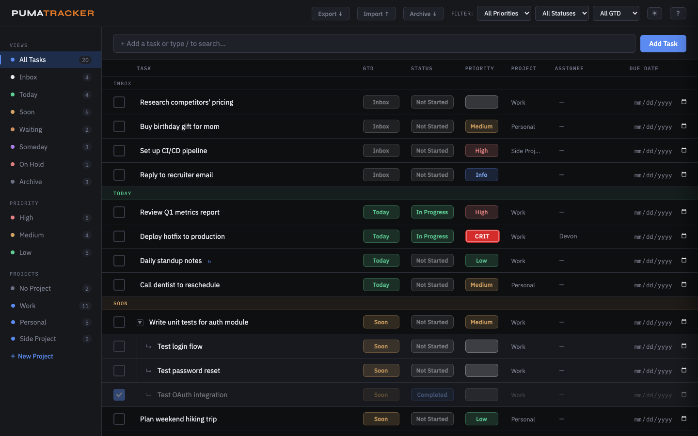
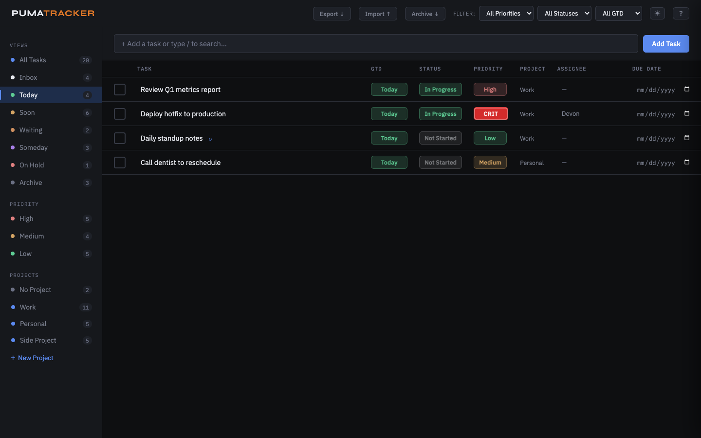
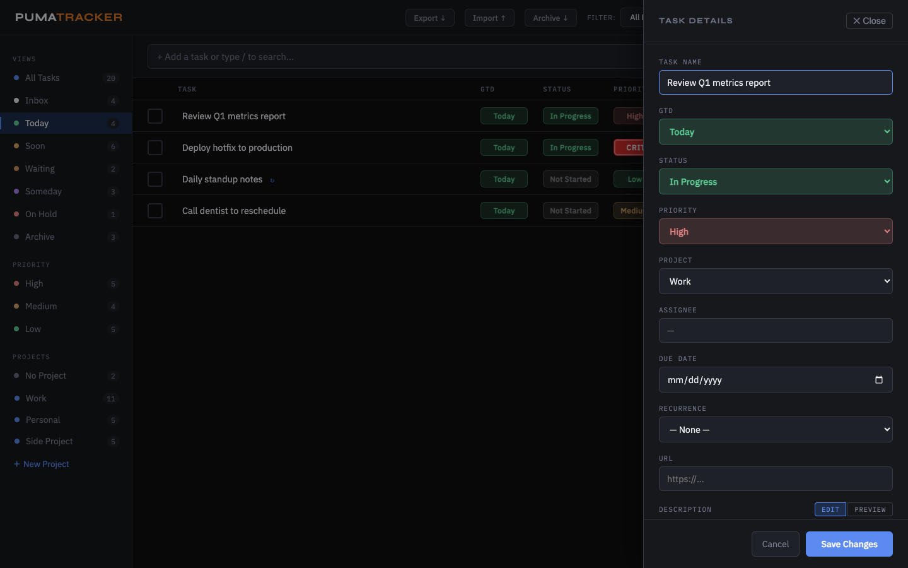
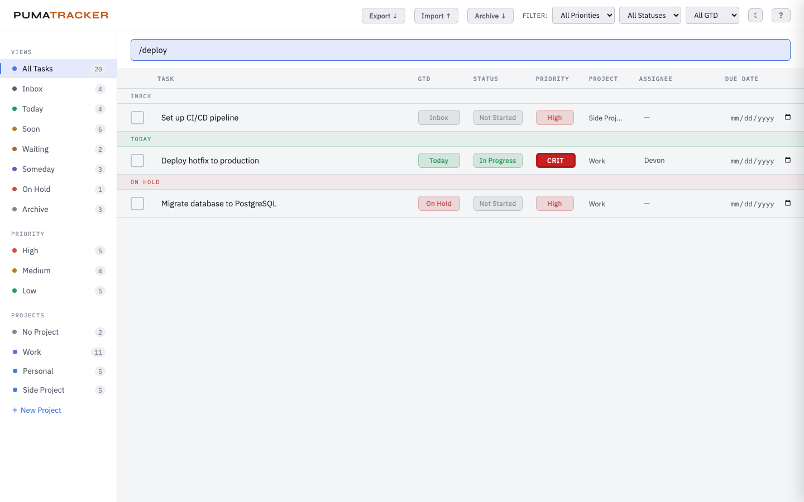
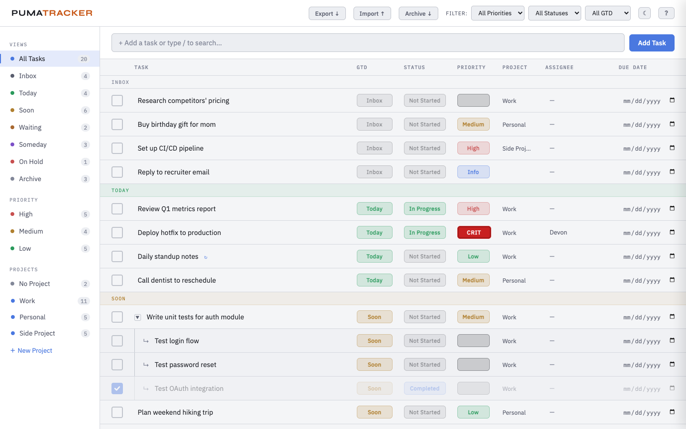

# PumaTracker

A single-user, offline-first task manager built on [GTD](https://gettingthingsdone.com/) principles. Runs entirely in the browser with no server, no account, and no internet connection required. Zero dependencies.



## Usage

Open `index.html` in your browser. That's it.

> Alternatively, serve it locally with `python3 -m http.server 8080` and open `http://localhost:8080/index.html`.

On first launch, a welcome screen explains the basics and reminds you to export your data regularly.

---

## Features

### GTD Views
Tasks are organized into seven GTD buckets, accessible from the sidebar:

| View | Purpose |
|------|---------|
| **Inbox** | Unprocessed captures |
| **Today** | Committed to today |
| **Soon** | On deck for the near future |
| **Waiting** | Blocked on someone else |
| **Someday** | Low-urgency ideas |
| **On Hold** | Paused pending external factors |
| **Archive** | Completed and archived tasks |



### Tasks
- Add tasks by typing in the input bar and pressing **Enter**
- **Inline rename** — click a task name to edit it in place
- **Checkbox** — click to toggle done/undone (animated checkmark)
- **Pill selects** — change GTD, Status, and Priority directly in the row
- **Subtasks** — one level deep; add via right-click context menu
- **Recurrence** — daily, weekly, monthly, or yearly; spawns the next occurrence on completion
- **Due dates** — overdue dates highlighted in red with pulsing indicator
- **Assignee and URL** fields in the task detail panel
- **Comments** — timestamped log entries per task with markdown support
- **Delete confirmation** — task deletion requires explicit confirmation



### Live Search
Type `/` in the add-task input to enter search mode. The task list live-filters as you type, matching against task names, descriptions, and assignees. Press **Escape** to clear the search and return to normal view.



### Markdown Descriptions
The task detail panel supports markdown in descriptions with an **Edit/Preview** toggle:
- Headings (`# H1`, `## H2`, `### H3`)
- **Bold** (`**text**`) and *italic* (`*text*`)
- Inline `code` and fenced code blocks (` ``` `)
- Bullet lists (`- item`)
- Blockquotes (`> quote`)
- [Links](`[text](url)`)
- Horizontal rules (`---`)

Comments also render markdown automatically.

### Projects
- Create, rename, and delete projects from the sidebar
- Drag to reorder projects
- Filter the task list to a single project by clicking it

### Filtering
- **Sidebar** — filter by GTD view, priority level, or project
- **Topbar dropdowns** — cross-filter by Priority, Status, and GTD simultaneously
- **Search** — type `/query` in the input bar for instant text search

### Dark / Light Theme
Click the **sun/moon toggle** in the topbar to switch between dark and light themes. Your preference is saved to localStorage and persists across sessions.



### Data
- **Export** — downloads a dated JSON backup of all tasks, projects, and comments
- **Import** — restores data from a previously exported JSON file (with confirmation prompt)
- **Archive** — moves all completed tasks to the Archive view

---

## Keyboard Shortcuts

Press **`?`** anywhere in the app (when not typing) to open the shortcuts reference panel.

| Key | Action |
|-----|--------|
| `j` / `↓` | Next task |
| `k` / `↑` | Previous task |
| `Enter` | Open task detail panel |
| `e` | Rename focused task |
| `Esc` | Clear focus / close panel / clear search |
| `Cmd/Ctrl+S` | Save task panel |
| `/` | Search tasks (type in add-task input) |
| `?` | Show keyboard shortcuts |

---

## Accessibility

- Semantic HTML with `<main>`, `<nav>`, proper heading hierarchy
- ARIA roles and labels on all interactive elements (checkboxes, selects, dialogs, menus)
- Focus trapping in modals and panels
- Keyboard-navigable throughout (tab, arrow keys, Enter, Escape)
- Focus-visible indicators on all interactive elements
- Skip-to-content link
- `prefers-reduced-motion` respected — all animations disabled
- Contrast ratios meet WCAG AA (4.5:1+)
- Touch targets sized for mobile (32px+ checkboxes, 36px+ buttons)

---

## Responsive Design

| Breakpoint | Behavior |
|------------|----------|
| **Desktop** (1024px+) | Full sidebar, all 8 table columns, filter dropdowns |
| **Tablet** (768–1023px) | Narrower sidebar, assignee column hidden |
| **Mobile** (360–767px) | Off-canvas sidebar drawer, status/project/assignee/due columns hidden |
| **Small mobile** (<360px) | GTD and priority columns also hidden, compact topbar |

---

## Data Handling

All data is stored in your browser's **localStorage** under these keys:

| Key | Contents |
|-----|----------|
| `pumatracker.tasks` | All tasks and subtasks |
| `pumatracker.groups` | Projects |
| `pumatracker.notes` | Per-task comments |
| `pumatracker.theme` | Dark/light preference |
| `pumatracker.welcomed` | First-run flag |

### What this means
- **Data is local to your browser.** Opening the file from a different browser or device will show an empty app.
- **Clearing browser data will erase your tasks.** Use Export regularly to back up your data.
- **Incognito/private mode does not persist data** across sessions.
- **The file itself contains no data.** The HTML file is just the app; your data lives separately in localStorage.

### Recommended workflow
1. Use **Export** periodically to save a dated JSON backup.
2. To move to a new browser or device, Export on the old one and Import on the new one.
3. To reset to a clean state, Import a file with empty arrays or clear localStorage manually.

### Demo data
A `demo.json` file is included with sample tasks covering all GTD views, priorities, statuses, subtasks, and recurrence. To load it, open the browser console and run:

```js
fetch('demo.json').then(r=>r.json()).then(d=>{
  localStorage.setItem('pumatracker.tasks',  JSON.stringify(d.tasks));
  localStorage.setItem('pumatracker.groups', JSON.stringify(d.groups));
  localStorage.setItem('pumatracker.notes',  JSON.stringify(d.notes));
  location.reload();
});
```

> This requires the file to be served (e.g. via `python3 -m http.server`), not opened directly as `file://`.

---

## Security

- **Content Security Policy** — strict CSP header blocks external scripts, styles, and connections
- **XSS protection** — all user content is HTML-escaped before rendering
- **Import sanitization** — imported data is validated with field whitelists, type coercion, and length limits
- **No external requests** — the app makes zero network calls (fonts are embedded as base64)

## License

MIT
